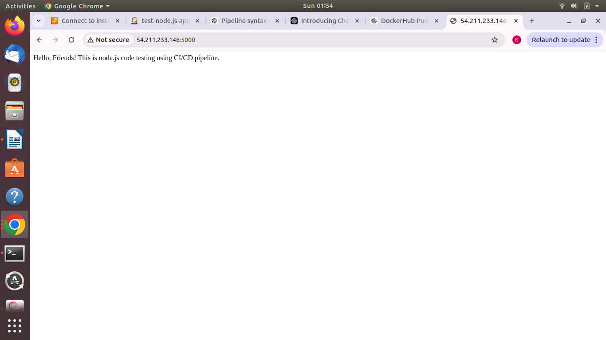
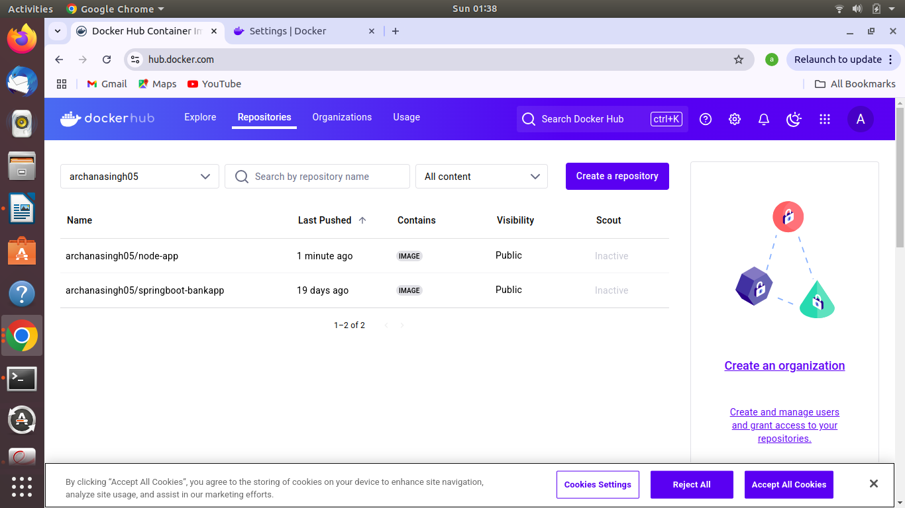

# Node.js CI/CD Pipeline with Jenkins, Docker, and GitHub Webhooks

This project demonstrates a CI/CD pipeline using Jenkins, Docker, and GitHub Webhooks to automate the process of building, testing, and deploying a simple Node.js application to a cloud environment (e.g., AWS EC2).

## Project Overview

This project features a simple Node.js web application that displays the message: **"Hello, Friends! This is node.js code testing using CI/CD pipeline."** when accessed. The purpose of this repository is to demonstrate an automated CI/CD pipeline using Jenkins and Docker to:

- Build and test the app.
- Create a Docker image.
- Push the Docker image to Docker Hub.
- Deploy the app to a cloud instance (AWS EC2).

The pipeline is triggered by a GitHub webhook, which activates the build process whenever changes are pushed to the repository.

## Technologies Used

- **Node.js**: Backend application framework.
- **Docker**: Containerization platform to package the app.
- **Jenkins**: Automation server for CI/CD pipeline.
- **GitHub**: Version control and source code management.
- **AWS EC2**: Cloud deployment platform.
- **GitHub Webhook**: To trigger Jenkins builds on code push events.

## Getting Started

Follow these steps to set up the project locally and configure the CI/CD pipeline:

1. **Create the Project Directory**:
    mkdir ci-cd-pipeline-node.js
    cd ci-cd-pipeline-node.js

2. **Create Dockerfile**: Create a `Dockerfile` in your project directory with the necessary instructions to build your Node.js application.
    
3. **Build Docker Image**:
   docker build -t node-app .

4. **Create Docker Volume**:
    docker volume create myvolume

5. **Create Docker Network**:
    docker network create -d bridge mynetwork

6. **Run Container Using Dockerfile**:
    docker run -it -d --name mycontainer -p 5000:5000 --network bridge -v myvolume:/var node-app

   # Result:

# Install Java and Jenkins

## 1. Install Java
First, update your package index and install OpenJDK 11:

sudo apt update
sudo apt install openjdk-11-jdk -y

## 2. Install Jenkins
Follow the installation instructions for your operating system from [Jenkins' official website](https://www.jenkins.io/doc/book/installing/).

## 3. Configure GitHub Webhook
To enable Jenkins to trigger builds based on code changes in your GitHub repository:

- Go to your GitHub repository settings.
- Under "Webhooks," add a new webhook that points to your Jenkins server URL (e.g., `http://your-jenkins-url/github-webhook/`).

# Jenkins Pipeline Setup

## 1. Create a Jenkins Pipeline
To create a new Jenkins pipeline, follow these steps:

1. **Go to the Jenkins Dashboard**:
   - Click on **New Item**.

2. **Select Pipeline**:
   - Enter a name for your pipeline, e.g., `node,js-CI/CD-pipeline`.
   - Choose **Pipeline** and click **OK**.

3. **Configure the Pipeline**:
   - Under the **Pipeline** section, select **Pipeline script from SCM**.
   - Enter your GitHub repository URL.
   - Set the script path to `Jenkinsfile`.
   - Save and apply the configuration.

   The `Jenkinsfile` defines the CI/CD pipeline for this project.

## 2. Push Docker Image to Docker Hub
The Jenkins pipeline will automatically push the Docker image to Docker Hub after a successful build. Ensure you have:

- A Docker Hub account.
- Stored your Docker Hub credentials in Jenkins by navigating to **Manage Jenkins > Manage Credentials**.

## Running the Pipeline
Monitor the progress of the Jenkins pipeline from the Jenkins dashboard. The pipeline will execute the following steps:

1. **Checkout Code from GitHub**: Pulls the latest code from your repository.
2. **Install Dependencies**: Installs any required dependencies specified in your project.
3. **Run Tests**: Executes any tests defined in your project.
4. **Build Docker Image**: Creates a Docker image based on your application.
5. **Push Image to Docker Hub**: Pushes the built image to your Docker Hub repository.
6. **Deploy App to AWS EC2**: Deploys the application to a cloud instance.

     # Result:

    
