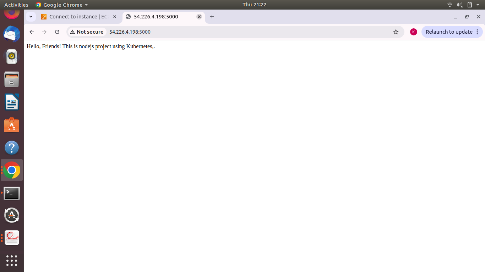

# Node.js CI/CD Pipeline with Jenkins, Docker, and GitHub Webhooks

This project demonstrates a CI/CD pipeline using Jenkins, Docker, and GitHub Webhooks to automate the process of building, testing, and deploying a simple Node.js application to a cloud environment (e.g., AWS EC2).

## Project Overview

This project features a simple Node.js web application that displays the message: **"Hello, Friends! This is node.js code testing using CI/CD pipeline."** when accessed. The purpose of this repository is to demonstrate an automated CI/CD pipeline using Jenkins and Docker to:

- Build and test the app.
- Create a Docker image.
- Push the Docker image to Docker Hub.
- Deploy the app to a cloud instance (AWS EC2).

The pipeline is triggered by a GitHub webhook, which activates the build process whenever changes are pushed to the repository.

## Technologies Used

- **Node.js**: Backend application framework.
- **Docker**: Containerization platform to package the app.
- **Jenkins**: Automation server for CI/CD pipeline.
- **GitHub**: Version control and source code management.
- **AWS EC2**: Cloud deployment platform.
- **GitHub Webhook**: To trigger Jenkins builds on code push events.

## Getting Started

Follow these steps to set up the project locally and configure the CI/CD pipeline:

1. **Create the Project Directory**:
    mkdir ci-cd-pipeline-node.js
    cd ci-cd-pipeline-node.js

2. **Create Dockerfile**: Create a `Dockerfile` in your project directory with the necessary instructions to build your Node.js application.
    
3. **Build Docker Image**:
   docker build -t node-app .

4. **Create Docker Volume**:
    docker volume create myvolume

5. **Create Docker Network**:
    docker network create -d bridge mynetwork

6. **Run Container Using Dockerfile**:
    docker run -it -d --name mycontainer -p 5000:5000 --network mynetwork -v myvolume:/var node-app

   # Result:

    
